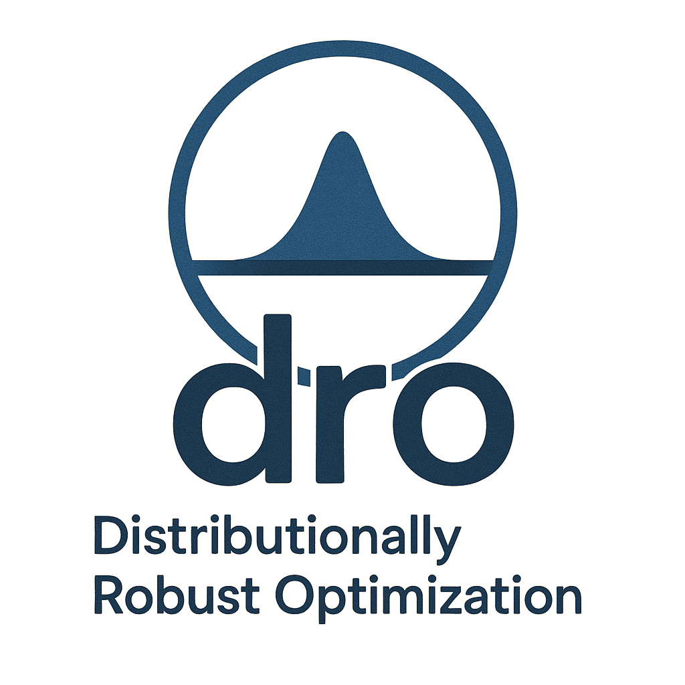

[](https://opensource.org/licenses/MIT)
[](https://pepy.tech/project/dro)
[](https://pypi.python.org/pypi/dro/)
[](https://codecov.io/github/namkoong-lab/dro)

# `dro`: A Python Package for Distributionally Robust Optimization in Machine Learning
> Jiashuo Liu<sup>†</sup>, Tianyu Wang<sup>†</sup>, Henry Lam, Hongseok Namkoong, Jose Blanchet  
> <sub>† equal contributions (α-β order)</sub>

<p align="center"></p>

`dro` is a python package that implements typical DRO methods on linear loss (SVM, logistic regression, and linear regression) for supervised learning tasks. It is built based on the convex optimization solver `cvxpy`. The `dro` package supports different kinds of distance metrics $d(\cdot,\cdot)$ as well as different kinds of base models (e.g., linear regression, logistic regression, SVM, neural networks...). Furthermore, it integrates different synthetic data generating mechanisms from recent research papers. 


Without specified, our DRO model is to solve the following optimization problem:
$$\min_{\theta} \max_{P: P \in U} E_{(X,Y) \sim P}[\ell(\theta;(X, Y))],$$
where $U$ is the so-called ambiguity set and typically of the form $U = \\{P: d(P, \hat P) \leq \epsilon\\}$ and $\hat P := \frac{1}{n}\sum_{i = 1}^n \delta_{(X_i, Y_i)}$ is the empirical distribution of training samples $\{(X_i, Y_i)\}_{i = 1}^n$. And $\epsilon$ is the hyperparameter. 

Please refer to our <a href="https://arxiv.org/pdf/2505.23565">paper</a> for more details. 
```bibtex
@misc{liu2025dropythonlibrary,
      title={DRO: A Python Library for Distributionally Robust Optimization in Machine Learning}, 
      author={Jiashuo Liu and Tianyu Wang and Henry Lam and Hongseok Namkoong and Jose Blanchet},
      year={2025},
      eprint={2505.23565},
      archivePrefix={arXiv},
      primaryClass={cs.LG},
      url={https://arxiv.org/abs/2505.23565}, 
}
```


## Installation

### (1) Install `dro` package
To install `dro` package, you can simply run:
```
pip install dro
```
And it will install all required packages.

### (2) Optional: Prepare `MOSEK` license
When implementing the solvers with exact solutions, our package is built upon `cvxpy`, and called based on `MOSEK` by default, which is efficient for all optimization problems encountered in the reformulation. `MOSEK` needs the license file. The steps are as follows:

* Request license at <a href="https://www.mosek.com/products/academic-licenses/">Official Website</a>, and then the license `mosek.lic` will be emailed to you.
* Put your license in your home directory as follows:

    ```
    cd
    mkdir mosek
    mv /path_to_license/mosek.lic  mosek/
    ```

Alternatively, we can set the solver among some open-source solvers such as `ECOS`, `SCS` in `cvxpy` (see <a href = "https://www.cvxpy.org/tutorial/solvers/index.html">here</a> for more details). In any given DRO model, this can be done during initialization:

    ```
    model = XXDRO(..., solver = 'ECOS')
    ```

by simply updating after initialization:

    ```
    model.solver = 'ECOS'
    ```

These solvers can solve all the optimization problems implemented in the package as well.


## Quick Start
A simple user example is as follows:
```python
from dro.src.data.dataloader_classification import classification_basic
from dro.src.data.draw_utils import draw_classification
from dro.src.linear_model.chi2_dro import Chi2DRO

# Data generating
X, y = classification_basic(d = 2, num_samples = 100, radius = 2, visualize = True)

# Chi-square DRO 
clf_model = Chi2DRO(input_dim=2, model_type = 'logistic')
clf_model.update({'eps': 0.1})
print(clf_model.fit(X, y))
```


For more examples, please refer to our <a href="https://python-dro.org/api/example.html">examples</a>.


## Documentation \& APIs

As for the latest `v0.3.1` version, `dro` supports:

### (1) Synthetic data generation


<table class="tg"><thead>
  <tr>
    <th class="tg-0pky">Python Module</th>
    <th class="tg-0pky">Function Name</th>
    <th class="tg-0pky">Description</th>
  </tr></thead>
<tbody>
  <tr>
    <td class="tg-0pky" rowspan="4"><br><br><br><br>dro.src.data.dataloader_classification</td>
    <td class="tg-0pky">classification_basic</td>
    <td class="tg-0pky">Basic classification task</td>
  </tr>
  <tr>
    <td class="tg-0pky">classification_DN21</td>
    <td class="tg-0pky">Following Section 3.1.1 of <br>[1]</td>
  </tr>
  <tr>
    <td class="tg-0pky">classification_SNVD20</td>
    <td class="tg-0pky">Following Section 5.1 of <br>[2]</td>
  </tr>
  <tr>
    <td class="tg-0lax">classification_LWLC</td>
    <td class="tg-0lax">Following Section 4.1 (Classification) of <br>[3]"</td>
  </tr>
  <tr>
    <td class="tg-0lax" rowspan="5"><br><br><br><br><br>dro.src.data.dataloader_regression</td>
    <td class="tg-0lax">regression_basic</td>
    <td class="tg-0lax">Basic regression task</td>
  </tr>
  <tr>
    <td class="tg-0lax">regression_DN20_1</td>
    <td class="tg-0lax">Following Section 3.1.2 of <br>[1]</td>
  </tr>
  <tr>
    <td class="tg-0lax">regression_DN20_2</td>
    <td class="tg-0lax">Following Section 3.1.3 of <br>[1]</td>
  </tr>
  <tr>
    <td class="tg-0lax">regression_DN20_3</td>
    <td class="tg-0lax">Following Section 3.3 of <br>[1]</td>
  </tr>
  <tr>
    <td class="tg-0lax">regression_LWLC</td>
    <td class="tg-0lax">Following Section 4.1 (Regression) <br>of [3]</td>
  </tr>
</tbody></table>

### (2) Linear DRO models
The models listed below are solved by exact solvers from ``cvxpy``.

<table class="tg"><thead>
  <tr>
    <th class="tg-0lax">Python Module</th>
    <th class="tg-0lax">Class Name</th>
    <th class="tg-0lax">Description</th>
  </tr></thead>
<tbody>
  <tr>
    <td class="tg-0lax">dro.src.linear_dro.base</td>
    <td class="tg-0lax">BaseLinearDRO</td>
    <td class="tg-0lax">Base class for linear DRO methods</td>
  </tr>
  <tr>
    <td class="tg-0lax"><span style="font-weight:400;font-style:normal;text-decoration:none">dro.src.linear_dro.chi2_dro</span></td>
    <td class="tg-0lax">Chi2DRO</td>
    <td class="tg-0lax">Linear chi-square divergence-based DRO</td>
  </tr>
  <tr>
    <td class="tg-0lax"><span style="font-weight:400;font-style:normal;text-decoration:none">dro.src.linear_dro.kl_dro</span></td>
    <td class="tg-0lax">KLDRO</td>
    <td class="tg-0lax">Kullback-Leibler divergence-based DRO</td>
  </tr>
  <tr>
    <td class="tg-0lax">dro.src.linear_dro.cvar_dro</td>
    <td class="tg-0lax">CVaRDRO</td>
    <td class="tg-0lax">CVaR DRO</td>
  </tr>
  <tr>
    <td class="tg-0lax">dro.src.linear_dro.tv_dro</td>
    <td class="tg-0lax">TVDRO</td>
    <td class="tg-0lax">Total Variation DRO</td>
  </tr>
  <tr>
    <td class="tg-0lax">dro.src.linear_dro.marginal_dro</td>
    <td class="tg-0lax">MarginalCVaRDRO</td>
    <td class="tg-0lax">Marginal-X CVaR DRO</td>
  </tr>
  <tr>
    <td class="tg-0lax"><span style="font-weight:400;font-style:normal;text-decoration:none">dro.src.linear_dro.mmd_dro</span></td>
    <td class="tg-0lax">MMD_DRO</td>
    <td class="tg-0lax">Maximum Mean Discrepancy DRO</td>
  </tr>
  <tr>
    <td class="tg-0lax"><span style="font-weight:400;font-style:normal;text-decoration:none">dro.src.linear_dro.conditional_dro</span></td>
    <td class="tg-0lax">ConditionalCVaRDRO</td>
    <td class="tg-0lax">Y|X (ConditionalShiftBased) CVaR DRO</td>
  </tr>
  <tr>
    <td class="tg-0lax"><span style="font-weight:400;font-style:normal;text-decoration:none">dro.src.linear_dro.hr_dro</span></td>
    <td class="tg-0lax">HR_DRO_LR</td>
    <td class="tg-0lax">Holistic Robust DRO on linear models</td>
  </tr>
  <tr>
    <td class="tg-0lax" rowspan="2"><br><br><span style="font-weight:400;font-style:normal;text-decoration:none">dro.src.linear_dro.wasserstein_dro</span></td>
    <td class="tg-0lax">WassersteinDRO</td>
    <td class="tg-0lax">Wasserstein DRO</td>
  </tr>
  <tr>
    <td class="tg-0lax">WassersteinDROsatisficing</td>
    <td class="tg-0lax">Robust satisficing version of Wasserstein DRO</td>
  </tr>
  <tr>
    <td class="tg-0lax">dro.src.linear_dro.sinkhorn_dro</td>
    <td class="tg-0lax">SinkhornLinearDRO</td>
    <td class="tg-0lax">Sinkhorn DRO on linear models</td>
  </tr>
  <tr>
    <td class="tg-0lax">dro.src.linear_dro.mot_dro</td>
    <td class="tg-0lax">MOTDRO</td>
    <td class="tg-0lax">Optimal Transport DRO with Conditional Moment Constraints</td>
  </tr>
  <tr>
    <td class="tg-0lax">dro.src.linear_dro.or_wasserstein_dro</td>
    <td class="tg-0lax">ORWDRO</td>
    <td class="tg-0lax">Outlier-Robust Wasserstein DRO</td>
  </tr>
</tbody></table>


### (3) NN DRO models
The models listed below are solved by gradient descent (``Pytorch``).


<table class="tg"><thead>
  <tr>
    <th class="tg-0lax">Python Module</th>
    <th class="tg-0lax">Class Name</th>
    <th class="tg-0lax">Description</th>
  </tr></thead>
<tbody>
  <tr>
    <td class="tg-0lax">dro.src.neural_model.base_nn</td>
    <td class="tg-0lax">BaseNNDRO</td>
    <td class="tg-0lax">Base model for neural-network-based DRO</td>
  </tr>
  <tr>
    <td class="tg-0lax">dro.src.neural_model.fdro_nn</td>
    <td class="tg-0lax">Chi2NNDRO</td>
    <td class="tg-0lax">Chi-square Divergence-based Neural DRO Model</td>
  </tr>
  <tr>
    <td class="tg-0lax">dro.src.neural_model.wdro_nn</td>
    <td class="tg-0lax">WNNDRO</td>
    <td class="tg-0lax">Wasserstein Neural DRO with Adversarial Robustness.</td>
  </tr>
  <tr>
    <td class="tg-0lax">dro.src.neural_model.hrdro_nn</td>
    <td class="tg-0lax">HRNNDRO</td>
    <td class="tg-0lax">Holistic Robust NN DRO</td>
  </tr>
</tbody>
</table>


### (4) Tree-based Ensemble DRO models
The models listed below are solved by function approximation (``xgboost``, ``lightgbm``).
<table class="tg"><thead>
  <tr>
    <th class="tg-0lax">Python Module</th>
    <th class="tg-0lax">Class Name</th>
    <th class="tg-0lax">Description</th>
  </tr></thead>
<tbody>
    <td class="tg-0lax" rowspan="3"><br><br><span style="font-weight:400;font-style:normal;text-decoration:none">dro.src.tree_model.lgbm</span></td>
    <td class="tg-0lax">KLDRO_LGBM</td>
    <td class="tg-0lax">KL Divergence-based Robust LightGBM</td>
  </tr>
  <tr>
    <td class="tg-0lax">CVaRDRO_LGBM</td>
    <td class="tg-0lax">CVaR Robust LightGBM</td>
  </tr>
    <td class="tg-0lax">Chi2DRO_LGBM</td>
    <td class="tg-0lax">Chi2 Divergence-based Robust LightGBM</td>
  </tr>
  <tr>
    <td class="tg-0lax">CVaRDRO_LGBM</td>
    <td class="tg-0lax">CVaR Robust LightGBM</td>
  </tr>
    <td class="tg-0lax" rowspan="3"><br><br><span style="font-weight:400;font-style:normal;text-decoration:none">dro.src.tree_model.xgb</span></td>
    <td class="tg-0lax">KLDRO_XGB</td>
    <td class="tg-0lax">KL Divergence-based Robust XGBoost</td>
  </tr>
  <tr>
    <td class="tg-0lax">Chi2DRO_XGB</td>
    <td class="tg-0lax">Chi2 Divergence-based Robust XGBoost</td>
  </tr>
  <tr>
    <td class="tg-0lax">CVaRDRO_XGB</td>
    <td class="tg-0lax">CVaR Robust XGBoost</td>
  </tr>

</tbody>
</table>

### (5) Model-based Diagnostics
In linear DRO models, we provide additional interfaces for understanding the worst-case model performance and evaluating the true model performance. 
<table class="tg"><thead>
  <tr>
    <th class="tg-0lax">Python Module</th>
    <th class="tg-0lax">Function Name</th>
    <th class="tg-0lax">Description</th>
  </tr></thead>
<tbody>
  <tr>
    <td class="tg-0lax"></td>
    <td class="tg-0lax">.worst_distribution</td>
    <td class="tg-0lax">the worst case distribution of the DRO model</td>
  </tr>
  <tr>
    <td class="tg-0lax"></td>
    <td class="tg-0lax">.evaluate</td>
    <td class="tg-0lax">true out-of-sample model performance of the DRO model</td>
  </tr>
</tbody>
</table>

For more details, please refer to https://python-dro.org for more details!

ps: our logo is generated via GPT:)


### Other Reference
[1] Learning Models with Uniform Performance via Distributionally Robust Optimization. Annals of Statistics. Annals of Statistics. 2021.

[2] Certifying Some Distributional Robustness with Principled Adversarial Training. ICLR 2018.

[3] Distributionally Robust Optimization with Data Geometry. NeurIPS 2022.

